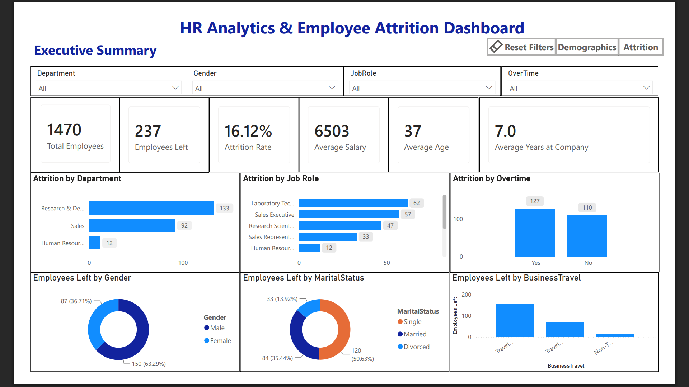
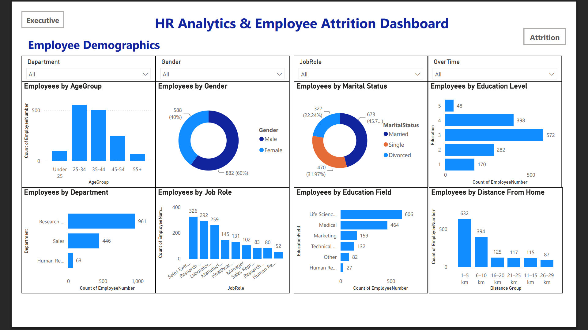
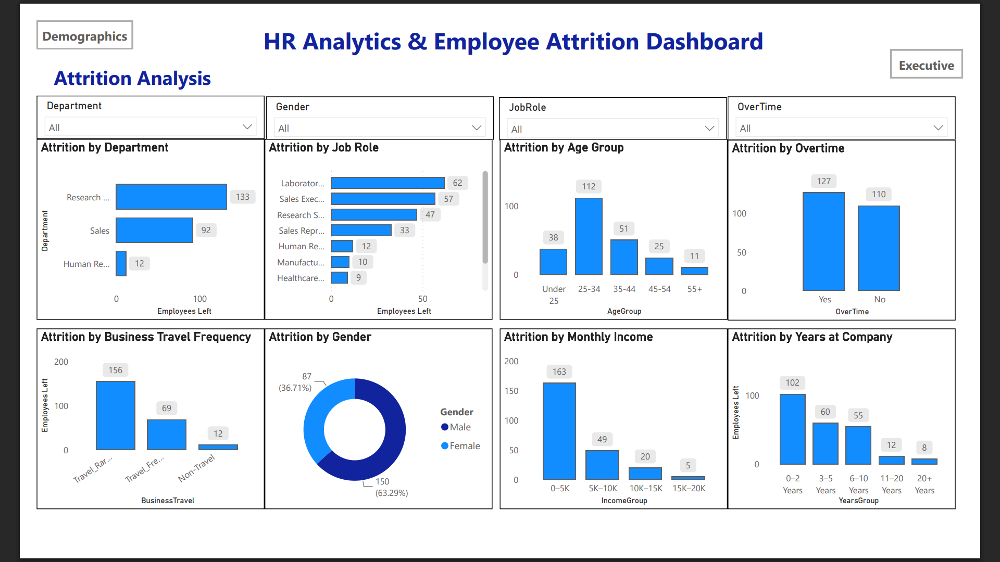

# 📊 HR Analytics & Employee Attrition Dashboard

An end-to-end HR Analytics project that analyzes employee attrition using **Python, SQL, and Power BI**. The project demonstrates the complete analytics workflow from data cleaning and SQL analysis to interactive dashboard development and business insights.

---

## 📌 Project Overview

Employee attrition is a major challenge for organizations as it impacts productivity, hiring costs, and business continuity. This project analyzes HR data to identify key factors contributing to employee attrition and presents actionable insights through an interactive Power BI dashboard.

The project follows a complete analytics pipeline:

**Raw Data → Data Cleaning (Python) → SQL Analysis → Power BI Dashboard → Business Insights**

---

# 🚀 Dashboard Preview

## Executive Summary



---

## Employee Demographics



---

## Attrition Analysis



---

# 📂 Project Structure

```text
HR Analytics & Employee Attrition Dashboard
│
├── dashboard_images/      # Dashboard screenshots
├── data/                  # Raw and cleaned datasets
├── docs/                  # Project documentation
├── notebooks/             # Data cleaning & EDA notebooks
├── powerbi/               # Power BI dashboard (.pbix)
├── reports/               # Exported PDF dashboard
├── sql/                   # SQL scripts
├── README.md
├── requirements.txt
├── LICENSE
└── .gitignore
```

---

# 🛠️ Technologies Used

- Python
- Pandas
- NumPy
- Matplotlib
- SQLite
- SQL
- Jupyter Notebook
- Power BI
- DAX
- Git
- GitHub

---

# 📈 Dashboard Features

### Executive Summary
- Total Employees
- Employees Left
- Attrition Rate
- Average Salary
- Average Age
- Average Years at Company

### Employee Demographics
- Age Group Analysis
- Gender Distribution
- Marital Status
- Education Level
- Department Distribution
- Job Role Distribution
- Distance from Home

### Attrition Analysis
- Attrition by Department
- Attrition by Job Role
- Attrition by Age Group
- Attrition by Business Travel
- Attrition by Gender
- Attrition by Monthly Income
- Attrition by Years at Company
- Attrition by Overtime

---

# 📊 Key Business Insights

- The overall employee attrition rate is **16.12%**.
- Research & Development has the highest number of employees leaving.
- Employees aged **25–34 years** show the highest attrition.
- Employees working overtime are more likely to leave.
- Employees in the **0–5K salary range** experience the highest attrition.
- Most resignations occur within the first **0–2 years** of employment.

---

# 🔄 Project Workflow

```text
HR Dataset
     │
     ▼
Python Data Cleaning
     │
     ▼
SQL Business Analysis
     │
     ▼
Power BI Data Model
     │
     ▼
Interactive Dashboard
     │
     ▼
Business Insights
```

---

# ⚙️ Installation

Clone the repository:

```bash
git clone https://github.com/Dhineshmurali12/HR-Analytics-Employee-Attrition-Dashboard.git
```

Navigate to the project:

```bash
cd HR-Analytics-Employee-Attrition-Dashboard
```

Install dependencies:

```bash
pip install -r requirements.txt
```

Open:

- Jupyter notebooks for Python analysis
- SQL scripts for database analysis
- Power BI Desktop for the interactive dashboard

---

# 📄 Dashboard Report

The exported Power BI dashboard is available in:

```
reports/HR_Analytics_Employee_Attrition_Dashboard.pdf
```

---

# 🎯 Future Improvements

- Predict employee attrition using Machine Learning
- Add forecasting visuals
- Connect to a live SQL database
- Deploy dashboards using Power BI Service
- Automate data refresh

---

# 👨‍💻 Author

**Dhinesh Murali**

- GitHub: https://github.com/Dhineshmurali12
- LinkedIn: https://www.linkedin.com/in/dhineshm12

---

## ⭐ If you found this project helpful, consider giving it a star!